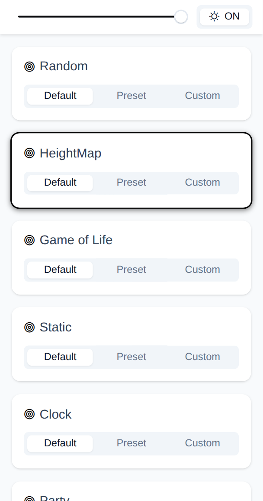
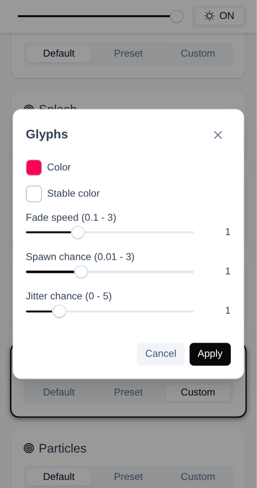

# RPi LED Panels Frontend

This is the web-based frontend interface for the **[RPi LED Panels](https://github.com/MaelCrd/rpi-led-panels)** project.

It provides a user-friendly dashboard to remotely control the RGB LED matrix panels directly from a web browser. The frontend communicates with the C++ backend's REST API to switch animations, tweak configuration parameters, adjust brightness, and toggle the display state.

> [!NOTE]
> The UI is currently optimized for mobile viewports only. When viewing on desktop, using your browser's mobile emulation mode is recommended.

## Features

- **Remote control:** Switch between available animations (Game of Life, Matrix, Heightmap, Particles, etc.) instantly.
- **Parameter tuning:** Dynamically adjust animation-specific settings on the fly.
- **System controls:** Change panel brightness or toggle the display on/off.
- **Modern UI:** Built using Vue 3, Vite, and PrimeVue for a clean interface.

## Screenshots

<table>
  <tr>
    <td align="center" width="50%"><b>Animations list</b></td>
    <td align="center" width="50%"><b>Custom settings</b></td>
  </tr>
  <tr>
    <td></td>
    <td></td>
  </tr>
</table>

## Prerequisites

- [Node.js](https://nodejs.org/) installed on the development machine.
- `pnpm` or `npm`.

## Local Development

1. **Clone the repository:**

   ```bash
   git clone https://github.com/MaelCrd/rpi-led-panels-frontend.git
   cd rpi-led-panels-frontend
   ```

2. **Install dependencies:**

   ```bash
   pnpm install
   # or npm install
   ```

3. **Start the development server:**

   ```bash
   pnpm run dev
   # or npm run dev
   ```

   This will spin up a local development server, typically at `http://localhost:5173`.

   *(Note: For the interface to fully function, the backend must be running and accessible over the network to handle the API calls.)*

## Deployment to Raspberry Pi

A convenience script (`send_to_pi.sh`) is included to automate the process of building the production bundle and securely copying it to your Raspberry Pi.

```bash
./send_to_pi.sh
```

**Note:** By default, the script assumes the Raspberry Pi is accessible via SSH as `root@pi` and that is serving the frontend files from `/var/www/vue-app`. You may need to edit `send_to_pi.sh` to match the Pi's actual hostname, IP address, user, or target web server directory.

## Backend Repository

This repository only contains the web frontend. The core C++ application, hardware driving logic, and the REST API server are located in the main project here: [RPi LED Panels](https://github.com/MaelCrd/rpi-led-panels).
